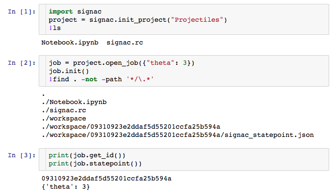
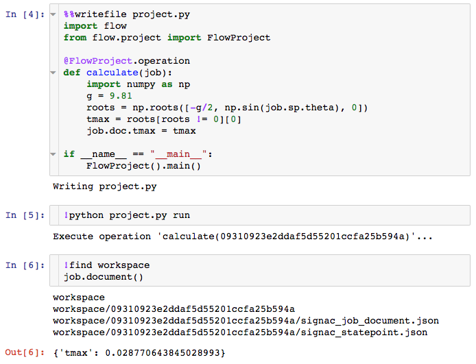

:author: Vyas Ramasubramani
:email: vramasub@umich.edu
:institution: Department of Chemical Engineering, University of Michigan, Ann Arbor

:author: Carl S. Adorf
:email: csadorf@umich.edu
:institution: Department of Chemical Engineering, University of Michigan, Ann Arbor

:author: Paul M. Dodd
:email: pdodd@umich.edu
:institution: Department of Chemical Engineering, University of Michigan, Ann Arbor

:author: Bradley D. Dice
:email: bdice@umich.edu
:institution: Department of Physics, University of Michigan, Ann Arbor

:author: Sharon Glotzer
:email: sglotzer@umich.edu
:institution: Department of Chemical Engineering, University of Michigan, Ann Arbor
:institution: Department of Materials Science and Engineering, University of Michigan, Ann Arbor
:institution: Department of Physics, University of Michigan, Ann Arbor
:institution: Biointerfaces Institute, University of Michigan, Ann Arbor

:bibliography: paper

-----------------------------------------------------------
signac: A Python framework for data and workflow management
-----------------------------------------------------------

.. class:: abstract

Computational research requires versatile data and workflow management tools that can easily adapt to the highly dynamic requirements of scientific investigations.
Many existing tools require strict adherence to a particular usage pattern, so researchers often use less robust ad hoc solutions that they find easier to adopt.
The resulting data fragmentation and methodological incompatibilities significantly impede research.
This paper showcases signac, an open-source Python framework that offers highly modular and scalable solutions for this problem.
The framework's powerful workflow management tools enable users to construct and automate workflows that transition seamlessly from laptops to HPC clusters.
Crucially, the underlying data model is completely independent of the workflow.
The flexible, serverless, and schema-free signac database can be introduced into other workflows with essentially no overhead and no recourse to the signac workflow model.
Additionally, the data model's simplicity makes it easy to parse the underlying data without using signac at all.
This modularity and simplicity eliminates significant barriers for consistent data management across projects, facilitating improved provenance management and data sharing with minimal overhead.

.. class:: keywords

	data management, database, data sharing, provenance, computational workflow

Introduction
------------

.. figure:: summary_figure.pdf
   :align: center
   :scale: 100 %
   :figclass: w

   The data in a signac project (A) is contained in its workspace (dark grey outline), which in turn is composed of individual data points (grey points) that exist within some multidimensional parameter space (light grey background)
   Each data point, or job, is associated with a unique hash value (e.g., 3d5) computed from its state point, the unique key identifying the job
   Using signac, the data can be easily searched, filtered, grouped, and indexed
   To generate and act on this data space, signac can be used to define workflows (B), which are generically represented as a set of operations composing a directed, acyclic graph
   Using a series of pre- and post-conditions defined on these operations, signac tracks the progress of this workflow on a per-job basis (C) to determine whether a particular job is complete (greyed text, green check), eligible (bold text, arrow), or blocked (normal text, universal no).
   :label:`fig:summary`

Streamlining data generation and analysis is a critical challenge for science in the age of big data and high performance computing (HPC).
Modern computational resources can generate and consume enormous quantities of data, but process automation and data management tools have lagged behind.
The highly file-based workflows characteristic of computational science are not amenable to traditional relational databases, and HPC applications require that data is available on-demand, enforcing strict performance requirements for any data storage mechanism.
Building processes acting on this data requires transparent interaction with HPC clusters without sacrificing testability on personal computers, and these processes must be sufficiently malleable to adapt to changes in scientific inquiries.

Consider studying the motion of an object through a fluid medium.
If we initially model the motion only as a function of one parameter, an ad hoc solution for data storage would be to store the trajectories in paths named for the values of this parameter.
If we then introduce some post-processing step, we could run it on each of these files.
However, a problem arises if we realize that some additional parameter is also relevant.
A simple solution might be to just rename the files to account for this parameter as well, but this approach would quickly become intractable if the parameter space increased further.
A more flexible traditional solution involving the use of, e.g., a relational MySQL :cite:`mysql` database might introduce undesirable setup costs and performance bottlenecks for file-based workflows on HPC.
Even if we do employ such a solution, we also have to account for our workflow process: we need a way to run analysis and post-processing on just the new data points without performing unnecessary work on the old ones.

This paper showcases the signac framework, a data and workflow management tool that aims to address these issues in a simple, powerful, and flexible manner (:ref:`fig:summary`).
By storing JSON-encoded metadata and the associated data together directly on the file system, signac provides database functionality such as searching and grouping data without the overhead of maintaining a server or interfacing with external systems, and it takes advantage of the high performance file systems common to HPC.
With signac, data space modifications like the one above are trivially achievable with just a few lines of Python code.
Additionally, signac's workflow component makes it just as easy to modify the process of data generation, since we simply define the post-processing as a Python function.
The workflow component of the framework, signac-flow, will immediately enable the use of this calculation on the existing data space through a single command, and it tracks which tasks are completed to avoid redundancy.
The resulting data can be accessed without reference to the workflow, ensuring that it is immediately available to anyone irrespective of the tools they are using.

Overview and Examples
---------------------

   A very simple example using signac to create the basics of a data space.
   In this example, all work is conducted inside a Jupyter notebook to indicate how easily this can be done.
   Note how fewer than ten lines of code are required to initialize a database and add data.
   :label:`fig:data`

To demonstrate how signac works, we take a simple, concrete example of the scenario described above.
Consider an experiment in which we want to find the optimal launch angle to maximize the distance traveled by a projectile through air.
The first step is to initialize the data space, as shown in fig. :ref:`fig:data`.
Fig. :ref:`fig:data` provides a high level view of the core entities in the signac data model, along with some insight into the concrete representations.
The central object in the signac data model is the *project*, which represents all the data associated with a particular instance of a signac data space.
All of the project's data is contained within the *workspace* directory.
The workspace holds subdirectories corresponding to *jobs*, which are the individual data points in the data space.
Each job is uniquely identified by its *state point*, which is an arbitrary key-value mapping.
Although we see that these objects are stored in files and folders, we will show that these objects are structured in a way that provides layers of abstraction, making them far more useful than simple file system storage.

One could easily imagine interfacing existing scripts with this data model.
The only requirement is some concept of a unique key for all data so that it can be inserted into the database.
The unique key is what enables the creation of the 32 character hash, or *job id*, used to identify the job and its workspace folder (shown in fig. :ref:`fig:data`).
The uniqueness of this hash value is what enables all of signac's indexing and related functionality.

Ultimately, however, it is important to define the processes that generate and operate on this data cleanly and concisely.
The signac-flow component of the framework provides the tools to accomplish this.
In the below code block, we demonstrate how we could automate the generation of this data using signac-flow.

Note that signac-flow has a concept of a project, the *FlowProject*, that is distinct from the signac project; while the signac project provides the interface to the data, the FlowProject is the abstraction with which workflows are defined.
In this script, we are storing the output in the *job document*, a lightweight JSON storage mechanism that signac provides, but we could also directly store files into the job's workspace and operate on them later if we desired.
This unrestrictive model enables easy adaptation and modification as needed.
For example, if we instead wanted to consider how changing initial velocity affects the distance traveled for a particular angle, we can add the velocity to the existing job state points by taking advantage of the fact that the project object is an iterable:

.. code-block:: python

    import numpy as np
    for job in project:
        job.sp.v = 1

Rather than operating on all jobs, we may want to only operate on some subset.
One way to accomplish this would be to apply a filter within the loop using conditionals based on the job state point.
A more elegant solution, however, is to take advantage of signac's query API, which allows the user to find only the jobs of interest using a dictionary as a filter.
For example, in the above snippet we could replace ``for job in project`` with ``for job in project.find_jobs()``, using an arbitrary dictionary as the argument to ``find_jobs`` to filter on the state point keys.
The job finding functionality of signac is the entry point for its database functionality, enabling advanced indexing, selection, and grouping operations.

Having made the above change to our data space, we could now  easily add new data points to test:

.. code-block:: python

    from numpy import linspace
    for v in [1, 2, 3]:
        for theta in np.round(linspace(0, 1.57, 5), 2):
            sp = {"v": v, "theta": theta}
            project.open_job(sp).init()

Jobs that already exist in the data space will not be overwritten by the ``init`` operation, so there is no harm in performing a loop like this multiple times.

So far, we have shown examples of working with signac both in scripts and inside Jupyter notebooks.
In fact, all of signac's core functionality is also available on the command line, making it easy to interface signac with almost any pre-existing workflow.
While these features are critical for interfacing with non-Python code bases, they are also very useful for more ad hoc analyses of signac data spaces.
For example, the search functionality is available directly on the command line, which can be very useful for quick inspection of data:

.. code-block:: bash

    $ # Simple text queries are automatically
    $ # translated into JSON
    $ signac find theta 0.39
    Interpreted filter arguments as '{"theta": 0.39}'.
    d3012d490304c3c1171a273a50b653ad
    1524633c646adce7579abdd9c0154d0f
    22fa30ddf3cc90b1b79d19fa7385bc95

    $ # More complex queries can be constructed 
    $ # using JSON for operators
    $ signac find '{"v": {"$lt": 2}}'
    d61ac71a00bf73a38434c884c0aa82c9
    00e5f0c36294f0eee4a30cabb7c6046c
    585599fe9149eed3e2dced76ef246903
    22fa30ddf3cc90b1b79d19fa7385bc95
    9fa1900a378aa05b9fd3d89f11ef0e5b

The query syntax is based on the MongoDB :cite:`mongodb` syntax, enabling, *e.g.*, logical or arithmetic operators.
The use of this common syntax will help users familiar with MongoDB to begin using signac.
Additionally, signac enables easy export of its data to external database programs such as MongoDB, so the ability to use the same API in both cases should simplify that transition immensely.

Additionally, at any point we can get an overview of what the data space schema looks like:

.. code-block:: bash

    $ signac schema
    {
     'theta': 'int([3], 1), float([0.0, ..., 1.57], 5)',
     'v': 'int([1, 2, 3], 3)',
    }

Now that we have this data space, one could imagine defining more complex workflows than the simple single-operation one shown in fig. :ref:`fig:ops`.

   The signac-flow module enables the easy automation of workflows operating on signac workspaces.
   In this case, the workspace consists only of one job; the real power of the FlowProject arises from its ability to automatically handle an arbitrary sequence of operations on a large number of jobs.
   :label:`fig:ops`

In fact, signac-flow enables arbitrarily complex workflows that use pre- and post-conditions on individual operations to construct a directed acyclic graph:

.. code-block:: python

    # project.py (as shown in the notebook)
    ...
    @FlowProject.operation
    @FlowProject.post(lambda job: 'tmax' in job.document)
    def calculate(job):
        ...

In general, the ``project.py run`` interface demonstrated in fig. :ref:`fig:ops` will automatically run the entire workflow for every job in the workspace.
When conditions are defined the manner shown above, however, signac-flow will ensure that only incomplete tasks are run, i.e., once ``tmax`` has been calculated for a particular job, the ``calculate`` operation will not run again for that job.

While the default behavior of ``project.py run`` is to run all remaining steps in the workflow for every job, signac-flow also enables much more fine-grained control:

.. code-block:: bash

    $ # Runs all outstanding operations for all jobs
    $ python project.py run
    $ # Ignore workflow, run specific job-operation
    $ python project.py exec -o ${OP} -j ${JOB_ID}
    $ # Run up to two operations for a specific job
    $ python project.py run -j ${JOB_ID} -n 2

A critical feature of the signac framework is its scalability to HPC.
The file-based data model is designed to leverage the high performance file systems common on such systems, and workflows designed locally are immediately executable on HPC clusters.
In particular, any operation that can be successfully executed in the manner shown in fig. :ref:`fig:ops` can also be immediately submitted to cluster schedulers.
The signac-flow package achieves this by creating cluster job scripts that perform the above operations:

.. code-block:: bash

    $ # Print the script for one 12-hour job
    $ python project.py submit -n 1 -w 12 --pretend
    Submitting operation 'calculate' for job 'd61a...'
    #PBS -N d61ac71a00bf73a38434c884c0aa82c9-calculate
    #PBS -l walltime=12:00:00
    #PBS -l nodes=1
    #PBS -V
    set -e
    set -u

    cd /nfs/glotzer/projects/signac/scipy/sample_project

    # Operation 'calculate' for job 'd61a...':
    python project.py exec calculate d61a...

The workflow tracking functionality of signac-flow extends to compute clusters.
In general, users can always check the status of particular jobs to see how far they have progressed in the workflow.

.. code-block:: bash

    $ # Submit 3 random jobs for 12 hours
    $ python project.py submit -n 3 -w 12 --hold
    $ python project.py status -d
    Status project 'Projectiles':
    Total number of jobs: 16

    label    progress
    -------  ----------
    [no labels]

    Detailed view:
    job_id                             S    next_op 
    --------------------------------  ---  ---------
    00e5f0c36294f0eee4a30cabb7c6046c   U   calculate
    585599fe9149eed3e2dced76ef246903   A   calculate
    2faf0f76bde3af984a91b5e42e0d6a0b   U   calculate
    ...
    # Remainder omitted for brevity

    Abbreviations used:
    !: requires_attention
    A: active
    S: status
    U: unknown

All jobs in the projects are currently eligible for the ``calculate`` operation (*next_op* column), but jobs that are currently active on the cluster will be shown as such in the second column.
Once the operation has completed, the *next_op* column will become empty since the post-condition we defined has been met and no further operations need to be run.

The *labels* section showed above the list of jobs provides an additional way to enrich the status output.
Users have the option of creating and registering arbitrary functions as labels to provide additional information on job status.
When defined, these labels appear in a column to the right of the *next_op* column to indicate which labels apply to which jobs.
These labels can also be used as conditions for operation execution; for example, we could have a simple label defined by ``def calculated(job): tmax in job.document`` to indicate that the *calculate* operation had been performed.

The quick overview of this section highlights the core features of the signac framework.
Although the example demonstrated here is simple, the data model scales easily to thousands of data points and far more complex and nonlinear workflows.
Demonstrations can be seen on the documentation on ReadTheDocs (`https://signac.readthedocs.io <https://signac.readthedocs.io>`_), the signac website (`https://signac.io <https://signac.io>`_), or the paper in the Journal of Computational Materials Science :cite:`ADORF2018220`.

Design and Implementation
-------------------------

Having provided an overview of signac's functionality, we now provide a few more specifics on its implementation.
The framework prioritizes modularity and interoperability over monolithic functionality, so it is implemented in pure Python with no hard dependencies to ensure that it can be easily used with other programs.
The software runs equally well on Python 2.7 and 3.4+, and the full-featured command line interface enables its use even with non-Python tools.
To ensure that the data representation is completely independent of the workflow, the data component is developed as a standalone database solution.
This database is the primary dependency for signac-flow.

The signac package is designed to be as lightweight and flexible as possible, simultaneously offering the benefits of filesystem usage and more traditional DBMS.
From the Python implementation standpoint, the central component to the signac framework is the Project class, which provides the interface to signac's data model and features.
The signac project encapsulates much of the functionality for searching, selecting, and grouping individual data points from the data space.
Central to this process is signac's efficient on-the-fly indexing.
This process, which leverages the fact that the state point keys map uniquely to a workspace directory, uses filesystem crawlers to efficiently traverse the data space.
All functions that require indexes construct them automatically, which generally frees the user from explicit index construction.
Accessing individual data points from this index leads to the instantiation of Jobs, which are Python object handles that represent individual data points.
Since these data points effectively correspond to filesystem locations, they can be mapped directly and operated on in this fashion.

The central object in the signac-flow package is the Python *FlowProject* class, which encapsulates a set of operations acting on a signac data space.
There is a tight relationship between the FlowProject and the underlying data space, because operations are by default assumed to act on a per-job basis.
Using the sequence of conditions associated with each operation, a *FlowProject* also tracks workflow progress on per-job basis to determine which operations to run next for a given job.
Different HPC environments and cluster schedulers are represented by separate Python classes that provide the means for querying schedulers for cluster job statuses, writing out the job scripts, and constructing the submission commands.
Job scripts are created using templates written in ``jinja2`` :cite:`jinja2`, making them easily customizable for the requirements of specific compute clusters or users.
This means that workflows designed on one cluster can be easily ported to another, and that users can easily contribute new environment configurations that can be used by others.

The extensibility of the signac framework makes it easy to build other tools on top of signac.
One such tool is signac-dashboard, a web interface to signac data spaces that provides an easy way to visualize signac data spaces.
The tool has been released open source and is currently under active development.

Comparisons
-----------

Numerous tools have been developed for Python workflow management in recent years.
Of these, some of the best known are Fireworks :cite:`Fireworks`, AiiDA :cite:`Pizzi2016`, Sacred :cite:`sacred`, and Sumatra :cite:`sumatra`.
Fireworks and AiiDA are full-featured workflow managers that, like signac-flow, interface with high performance compute clusters to execute complex, potentially nonlinear workflows.
These tools in fact currently offer more powerful features than signac-flow for monitoring the progress of jobs, features that are supported by the use of databases on the back end.
However, with these software the data representation is far more rigid than with signac.
In particular, accessing the data outside the context of the workflow definition is much more difficult when using these tools, a significant limitation for data analysis and a barrier to integration with pre-existing workflows.
Additionally, the need to maintain a server for workflow management can be cumbersome and introduces additional unnecessary complexities.

Superficially, the signac framework appears quite similar to Sacred.
Both use decorators to convert functions into command line executable operations, and configurations can be injected into these functions (in signac's case, using the job object).
However, the similarities largely stop there; Sacred is much more focused on provenance management than defining complex workflows.
The tracking performed by Sacred is almost entirely focused on when an operation is executed, the configuration used, and whether any data was saved.
Therefore, in principle both pieces of software could be used to achieve different benefits.

However, Sacred is currently incompatible with signac-flow.
Sacred and signac-flow both depend on the registration of particular functions with some internal API: in signac-flow, functions are stored as operations within the *FlowProject*, whereas Sacred tracks functions through the *Experiment* class.
Since the actual script can only be run through one of these interfaces (whether on the command line or directly in Python), while it is possible to use signac's database facilities in concert with Sacred, running operations using signac-flow prevents tracking them using Sacred.
An alternative to Sacred is Sumatra, another Python provenance tracking tool that *can* be integrated with signac.
Sumatra provides a command line utility for simple usage, but it also allows direct integration into Python scripts via a Python API.
While the command line API is not flexible enough to allow passing arguments through to signac-flow, the Python API can be easily integrated into signac-flow operations for tracking workflows managed by signac-flow.

We have found fewer similar alternatives to the signac data model.
The closest comparison that we have found is datreant.core :cite:`datreant`, which provides the means for interacting with files on the file system along with some features for finding, filtering, and grouping.
There are two primary distinctions between datreant and signac: signac requires a unique key for each data point, and signac offers a tightly integrated workflow management tool.
The datreant data model is even simpler than signac's, which provides additional flexibility at the cost of signac's database functionality.
This difference is indicative of datreant's focus on more general file management problems than the issues signac is designed to solve.
The generality of the datreant data model makes integrating it into existing workflows just as easy as integrating signac, and the ``MDSynthesis`` package is one example of a workflow tool built around a datreant-managed data space.
However, this tool is highly domain-specific, unlike signac-flow, and it cannot be used for other types of computational investigations.
In the field of molecular simulation, the combination of MDSynthesis and datreant is the closest analog to the signac framework, but that software does not generalize to other use-cases.

Conclusions
-----------

The signac framework provides all the tools required for thorough data, workflow, and provenance management in scientific computing investigations.
Motivated by the need for managing the dynamic, heterogeneous data spaces characteristic of computational science investigations, the tools are tailored for the use-cases most commonly faced in this field.
The framework has strived to achieve high ease of use and interoperability by emphasizing simple interfaces, minimizing external requirements, and employing open data formats like JSON.
By doing so, the framework aims to minimize the initial barriers for new users, making it easy for researchers to begin using signac with little effort.
The framework frees computational scientists from repeatedly solving common data and workflow problems throughout their research, and at a higher level, reduces the burden of sharing data and provenance tracking, both of which are critical to accelerating the production of reproducible and reusable scientific results.
